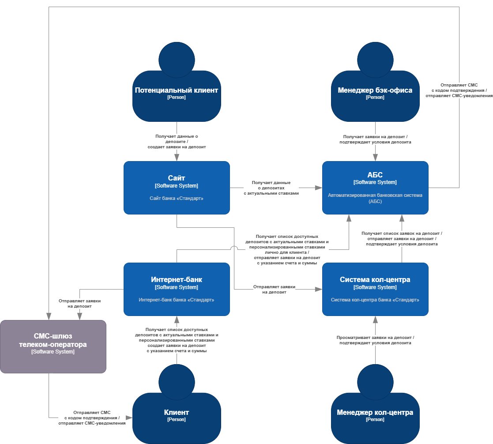

### **Название задачи:** MVP открытия депозитов онлайн
### **Автор:** Валерий Самойлов
### **Дата:** 14.06.2025
### **Функциональные требования**
Опишите здесь верхнеуровневые Use Cases. Их нужно оформить в виде таблицы с пошаговым описанием:

|**№**|**Действующие лица или системы**|**Use Case**|**Описание**|
| :-: | :- | :- | :- |
|UC1|Потенциальный клиент, Сайт, АБС|Отображение списка доступных депозитов|1. Потенциальный клиент открывает страницу сайта с условиями депозитов; 2. Сайт подгружает список доступных депозитов со ставками из БД сайта (В случае, если в базе данных нет ставок по депозитам, данные запрашиваются из АБС. Стандартные ставки по депозитам должны запрашиваться в АБС как минимум раз в день); 3. Потенциальный клиент видит доступные депозиты с актуальными ставками. |
|UC2|Потенциальный клиент, Сайт, Система кол-центра, Менеджер кол-центра| Отправка заявки на депозит | 1. Потенциальный клиент заполняет форму заявки на депозит (номер телефона, ФИО и другие данные); 2. После подтверждения заявка отправляется в систему кол-центра; 3. Заявка отображается в системе кол-центра; 4. Менеджер кол-центра обрабатывает заявку потенциального клиента и перезванивает ему с уточнёнными условиями по депозиту  |
|UC3|Клиент, Интернет-банк, АБС| Отображение списка доступных депозитов | 1. Клиент заходит в раздел депозитов интернет-банка; 2. Интернет-банк запрашивает у АБС список доступных депозитов с персонализированными ставками; 3. АБС возвращает список депозитов с персонализированными ставками интернет-банку; 3. Клиент просматривает список депозитов с персонализированными ставками; |
|UC4|Клиент, Интернет-банк, СМС-шлюз телеком-оператора, АБС|Отправка заявки на открытие депозита|1. Клиент заполняет форму заявки на депозит (счет и сумма депозита); 2. Клиент отправляет заявку на открытие депозита; 3. Интернет-банк отправляет клиенту СМС с кодом подтверждения операции через СМС-шлюз телеком-оператора; 4. Клиент вводит полученный код в поле подверждения заявки в интернет-банке; 5. Интернет-банк отправляет заявку клиента в АБС;|
|UC5|Менеджер бэк-офиса, АБС, СМС-шлюз телеком-оператора|Обработка заявки на депозит|1. Менеджер бэк-офиса заходит на страницу с заявкой в АБС; 2. Менеджер бэк-офиса подтверждает условия депозита в АБС; 3. Система отправляет клиенту смс-уведомление через шлюз телеком-оператора об открытии депозита;|
### **Нефункциональные требования**
Опишите здесь нефункциональные требования и архитектурно значимые требования.

|**№**|**Требование**|
| :-: | :- |
| R1  | Данные, на сайте и в интернет-банке, при передаче необходимо защищать с помощью механизма шифрования трафика |
| R2  | Все сервисы должны работать 24/7 |
| R3  | Все сервисы должны обеспечивать доступность на уровне 99,9% |
| U1  | Время отклика на действия пользователя не более 0,5 с (отклик по всем операциям должен быть максимально быстрым и занимать миллисекунды) |           
| +R1 | Желательно избежать прямой работы интернет-банка с API АБС |        
| +R2 | Макимальное использование имеющихся технологий БД(MS SQL и Oracle) |
| +R3 | Технологический стек ограничен Java, .NET |                        
| +R5 | Для очереди сообщений может быть использована только Kafka |   
     
### **Решение**
Приведите диаграммы контекста и контейнеров в модели C4. Опишите там основные компоненты и интеграции всех элементов решения. 
Диаграмма контекста:

Диаграмма контейнеров:

В рамках MVP ограничиваемся существующим стеком технологий, так как у текущей команды есть опыт работы с ним. Для взаимодействия с базой данных АБС добавим микросервис депозитов на C#/ASP.NET Core и базой данных на MS SQL (см. экспертиза команды), чтобы разгрузить базу данных АБС (управление запросами микросервис берёт на себя). Хотя использование очереди сообщений Kafka допустимо по условиям задачи, но, в связи с отсутсвием опыта у команды, увеличивается риск не попасть в сроки
 
### **Альтернативы**
Для MVP можно было бы оставить прямую интеграцию интернет-банка с АБС. Это решение упростило бы архитектуру и ускорило разработку, но повышаются риски эксплуатации системы в связи с увеличением нагрузки на АБС.

Другим вариантом является перевод АБС на микросервисную архитектур с асинхронным взаимодействием между компонентами. 
Существующая система может перестать справляться с потоком заявок клиентов после внедрения новой функциональности, но такой переход — это сложно и дорого, поэтому для MVP нецелесообразно. Однако, в случае успеха MVP, целесообразно будет разработать стратегию перехода на микросервису с использованием подхода Strangler Fig.

**Недостатки, ограничения, риски**

1. Сложности с интеграцией данных из Excel (существующий workflow) могут привести к задержкам интеграции
2. Текущая архитектура АБС не поддерживает горизонтальное масштабирование, что может привести к проблемам производительности при росте числа пользователей
3. Недостаточная экспертиза сотрудников в новых технологиях

