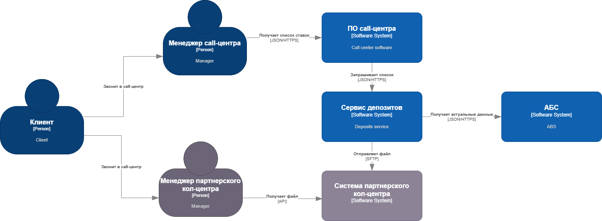

### **Название задачи:** MVP передачи ставок в кол-центр
### **Автор:** Валерий Самойлов
### **Дата:** 21.06.2025
### **Функциональные требования**
Опишите здесь верхнеуровневые Use Cases. Их нужно оформить в виде таблицы с пошаговым описанием:

|**№**|**Действующие лица или системы**|**Use Case**|**Описание**|
| :-: | :- | :- | :- |
|UC1.1|Клиент, Менеджер кол-центра, Система кол-центра банка "Стандарт", АБС|Консультация по актуальным депозитным ставкам в собственном кол-центре|1. Клиент звонит в кол-центр для уточнения условий по депозитам; 2. Менеджер кол-центра запрашивает текущие ставки по депозитам в Системе кол-центра банка "Стандарт"; 3. Если в системе кол-центра отсутствуют актуальные ставки, то они должны быть запрошены в АБС (может увеличиться время ожидания ответа от системы); 4. После получения ответа Менеджер кол-центра консультирует Клиента, исходя из полученой от Системы кол-центра информации. |
|UC1.2|Клиент, Менеджер партнёрского кол-центра, Система партнёрского кол-центра| Консультация по актуальным депозитным ставкам в партнёрском кол-центре |1. Звонок клиента, желающего уточнить условия по депозитам, перенаправлен в партнёрский кол-центр; 2. Менеджер партнёрского кол-центра получает из Системы партёрского кол-центра файл формата Excel с актуальными ставками по депозитам; 3. Менеджер партнёрского кол-центра консультирует Клиента, исходя из информации в файле. |
### **Нефункциональные требования**
Опишите здесь нефункциональные требования и архитектурно-значимые требования.

|**№**|**Требование**|
| :-: | :- |
| R1  | Данные, в том числе файлы для партнёрского кол-центра, при передаче необходимо защищать с помощью механизма шифрования трафика |
| R2  | Все сервисы должны работать 24/7 |
| R3  | Все сервисы должны обеспечивать доступность на уровне 99,9% |
| +R1 | У партнёрского кол-центра нет возможности делать API-вызовы |        
| +R2 | Макимальное использование имеющихся технологий |

### **Решение**
Приведите диаграммы контекста и контейнеров в модели C4. Опишите там основные компоненты и интеграции всех элементов решения. 
Диаграмма контекста:

Диаграмма контейнеров:

Добавлен микросервис депозитов для взаимодействия АБС и отправки файла с текущими ставками по депозитам по SFTP-протоколу, что позволит частично разгрузить базу данных АБС. 
Для микросервиса депозитов был выбран стэк C# ASP.NET Core и база данных MS SQL, так как у существующей команды опыт именно в этих технологих, а проводить обучение в рамках MVP грозит срывом сроков.

### **Альтернативы**
Интеграция партнёрского кол-центра с системой кол-центра банка "Стандарт" через специальный сервис позволила бы гарантировать актуальность данных на стороне партнёра. Однако такое решение требует дополнительных ресурсов (разработка специального сервиса) и необходимость дополнительной проработки аспектов безопасного доступа к системам банка. В рамках MVP такое решение излишне.

**Недостатки, ограничения, риски**

* Система партнерского кол-центра оперирует файлами, соответственно есть риск консультации по устаревшим данным.
* Требуется дополнительная безопасность для защиты файлов, передаваемых через интернет-каналы.

